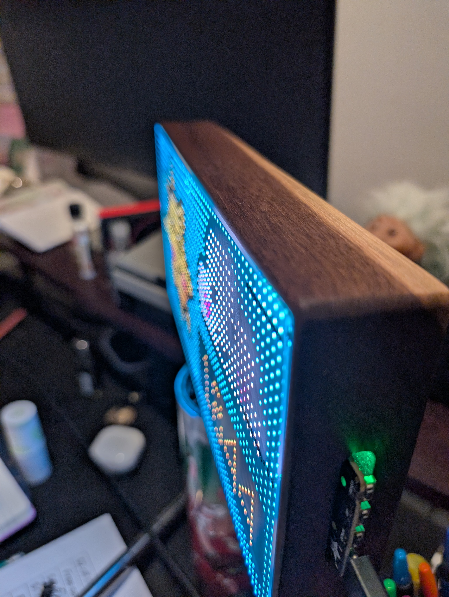

# Circuitpy - TikTok Follower Matrix Display

A real-time TikTok follower counter for the Adafruit Matrix Portal S3, displaying follower counts on a 64x32 RGB LED matrix.

## Project Gallery

### Display and Electronics


### Custom Walnut Case


*A custom-built TikTok follower counter featuring a CNC-machined walnut case and RGB LED matrix display.*




## Hardware Requirements

- [Adafruit Matrix Portal S3](https://www.adafruit.com/product/5778)
- 64x32 RGB LED Matrix
- USB-C cable for power and programming
- WiFi connection

## Software Requirements

- CircuitPython installed on the Matrix Portal S3
- Required libraries (copy to /lib folder on your CIRCUITPY drive):
  - adafruit_display_text
  - adafruit_requests.mpy
  - neopixel.mpy
  - adafruit_connection_manager.mpy

## Setup Instructions

1. Install CircuitPython on your Matrix Portal S3 if not already installed
   - [CircuitPython for Matrix Portal S3 Installation Guide](https://circuitpython.org/board/adafruit_matrixportal_s3/)
2. Clone the github repo
   ```bash
   git clone https://github.com/ENsef/circuitpy-tiktok-display.git
   ```
2. Copy the required libraries to the `lib` folder on your CIRCUITPY drive
3. Create a `settings.toml` file in the root directory with your configuration:
   ```toml
   CIRCUITPY_WIFI_SSID = "your_wifi_name_here"
   CIRCUITPY_WIFI_PASSWORD = "your_wifi_pass_here"
   TIKTOK_USERNAME = "your_tiktok_username"
   ```
4. Copy `code.py` to your CIRCUITPY drive
5. Copy `frame.bmp` (the display frame) to your CIRCUITPY drive

## Features

- Real-time TikTok follower count display
- Custom bitmap frame design
- Status LED indicators:
  - Blue: Starting up
  - Yellow: Fetching data
  - Green: Success
  - Red: Error
- Auto-formatting for large numbers (K/M suffixes)
- Automatic error recovery
- Configurable update interval

## Configuration

The display updates every 30 seconds by default. To modify the update interval, change the `UPDATE_INTERVAL` value in `code.py`.

## Error Handling

The system includes several error handling features:
- Automatic reconnection on WiFi issues
- LED status indicators for troubleshooting
- Automatic reset on critical errors
- Garbage collection to prevent memory issues

## Contributing

Feel free to fork this project and submit pull requests with improvements!

## License

MIT License

Copyright (c) 2024

Permission is hereby granted, free of charge, to any person obtaining a copy
of this software and associated documentation files (the "Software"), to deal
in the Software without restriction, including without limitation the rights
to use, copy, modify, merge, publish, distribute, sublicense, and/or sell
copies of the Software, and to permit persons to whom the Software is
furnished to do so, subject to the following conditions:

The above copyright notice and this permission notice shall be included in all
copies or substantial portions of the Software.

THE SOFTWARE IS PROVIDED "AS IS", WITHOUT WARRANTY OF ANY KIND, EXPRESS OR
IMPLIED, INCLUDING BUT NOT LIMITED TO THE WARRANTIES OF MERCHANTABILITY,
FITNESS FOR A PARTICULAR PURPOSE AND NONINFRINGEMENT. IN NO EVENT SHALL THE
AUTHORS OR COPYRIGHT HOLDERS BE LIABLE FOR ANY CLAIM, DAMAGES OR OTHER
LIABILITY, WHETHER IN AN ACTION OF CONTRACT, TORT OR OTHERWISE, ARISING FROM,
OUT OF OR IN CONNECTION WITH THE SOFTWARE OR THE USE OR OTHER DEALINGS IN THE
SOFTWARE.

## Credits

- Based on CircuitPython and Adafruit libraries
- Created by Brandon Honaker

## Support

If you encounter any issues or have questions, please open an issue in this repository.